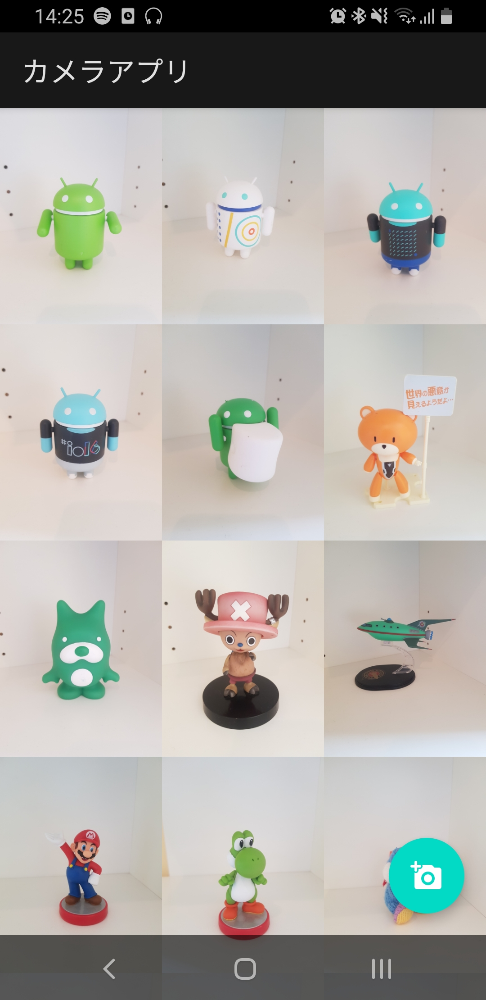
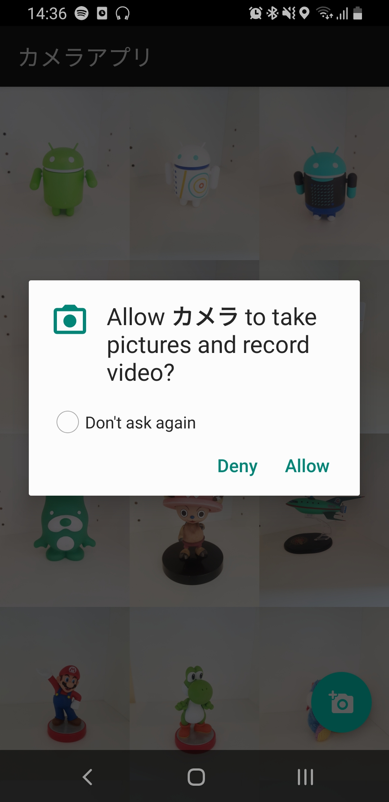
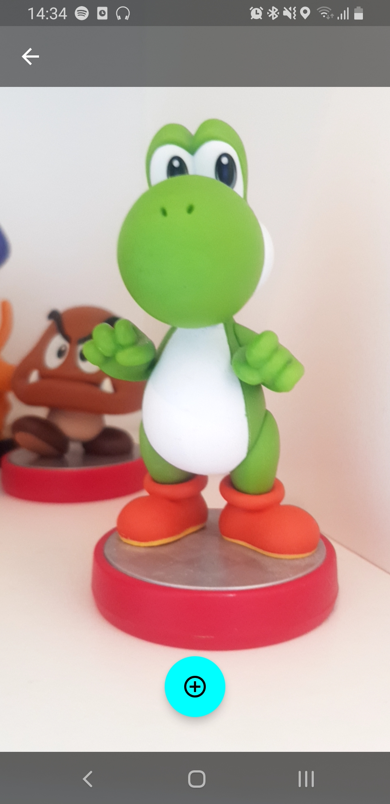

# Camera App

A simple app that
- Displays images from files.
- Handles Camera Permissions.
- Uses `CameraX` in a `AndroidViewBinding` Composable.
- Handles translucent status/navigation bar insets with `accompanist-insets`.

| List  | Permission  |  Camera |
|---|---|---|
|   |   |   |

## Setup
Built with Android Studio Arctic Fox Canary 14

#### Request Camera Permission

We check for relevant camera permissions before opening the camera screen when the user taps the FAB button. The FAB button is wrapped in a `RequestPermissionHandler`

``` kotlin
@Composable
fun RequestPermissionHandler(
    onPermissionResult: (Boolean) -> Unit,
    content: @Composable (ActivityResultLauncher<String>) -> Unit
) {
    val requestPermissionLauncher = rememberLauncherForActivityResult(
        ActivityResultContracts.RequestPermission()
    ) { isGranted: Boolean ->
        onPermissionResult(isGranted)
    }

    content(requestPermissionLauncher)
}
```

A `requestPermissionLauncher` is passed to child content to allow children decide the timing of the request.
An `onPermissionResult` is defined to allow us to perform an action on activity result.


#### Using CameraX

To make use of CameraX with compose we need to make use of an `AndroidViewBinding` Composable.
To do this we have an xml layout which contains a `PreviewView`.

``` xml
<?xml version="1.0" encoding="utf-8"?>
<FrameLayout xmlns:android="http://schemas.android.com/apk/res/android"
    android:layout_width="match_parent"
    android:layout_height="match_parent">

    <androidx.camera.view.PreviewView
        android:id="@+id/previewView"
        android:layout_width="match_parent"
        android:layout_height="match_parent" />
</FrameLayout>
```

This can then be made use of in a `@Composable` with `AndroidViewBinding`.

``` kotlin
@Composable
fun CameraPreview() {
    AndroidViewBinding(CameraHostBinding::inflate) {
		// do camera stuff
    }
}
```

#### Handling Window Insets

This app uses translucent status and navigation bars as defined in `themes.xml`

```xml
<item name="android:windowTranslucentNavigation">true</item>
<item name="android:windowTranslucentStatus">true</item>
```

To ensure propper padding is applied to toolbars, FABS etc we use [Insets for Jetpack Compose](https://github.com/google/accompanist/tree/main/insets).

We add a line `WindowCompat.setDecorFitsSystemWindows(window, false)` to our main activity `onCreate` and use a `ProvideWindowInsets` composable to apply window insets.

``` kotlin
override fun onCreate(savedInstanceState: Bundle?) {
    super.onCreate(savedInstanceState)
    WindowCompat.setDecorFitsSystemWindows(window, false)

    setContent {
        ProvideWindowInsets {
            CameraApp()
        }
    }
}
```

This easily allows us to adjust padding by adjusting modifiers e.g.

``` kotlin
// account for status bar
Modifier.constrainAs(appBar) {
    top.linkTo(parent.top)
    start.linkTo(parent.start)
    end.linkTo(parent.end)
}
.statusBarsPadding()

// account for navigation bar
Modifier.constrainAs(fab) {
    bottom.linkTo(parent.bottom, margin = 32.dp)
    start.linkTo(parent.start)
    end.linkTo(parent.end)
}
.navigationBarsPadding()
```
